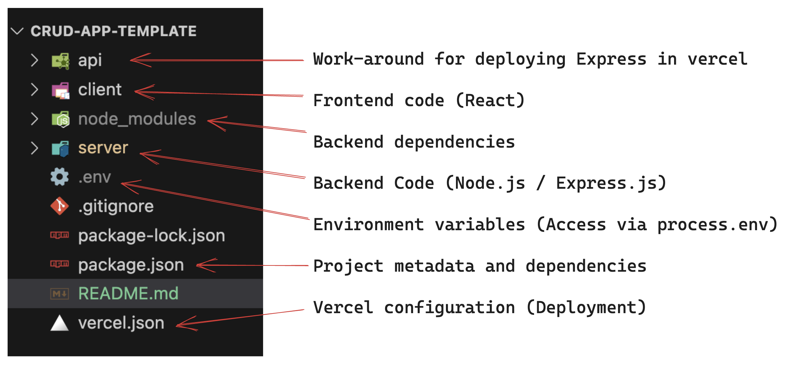
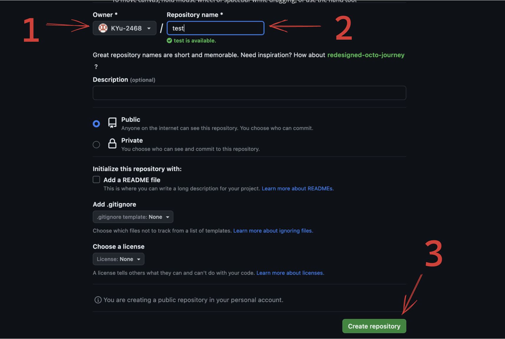
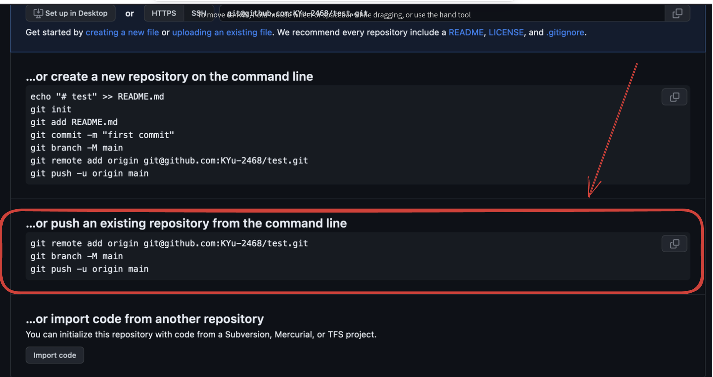
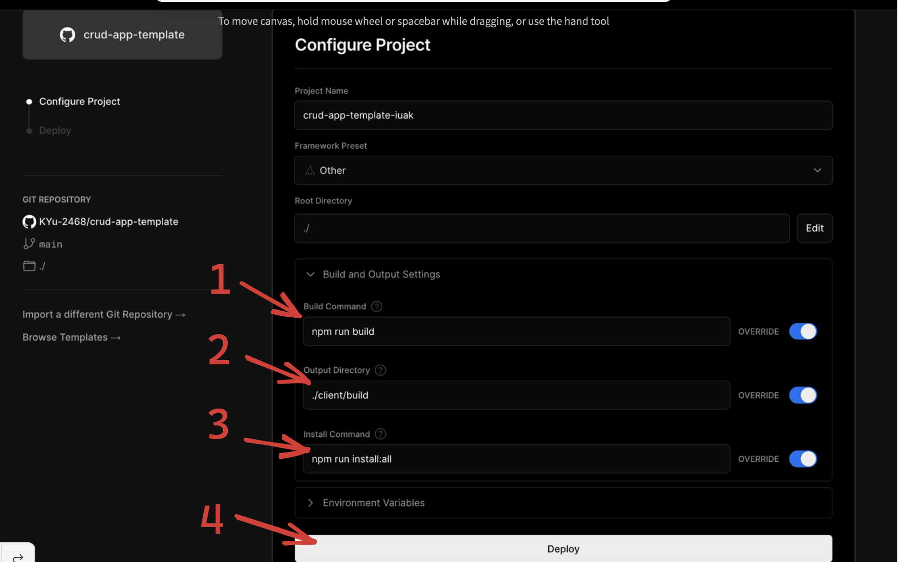
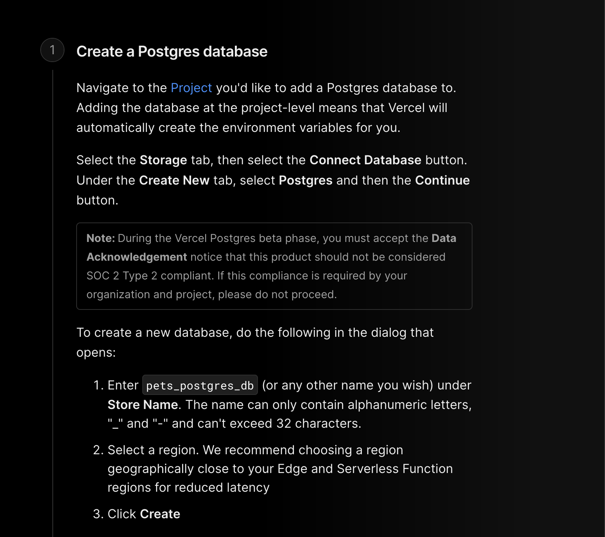
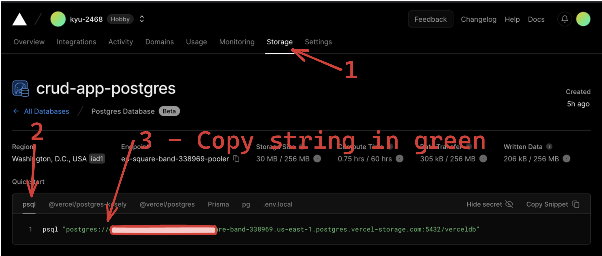
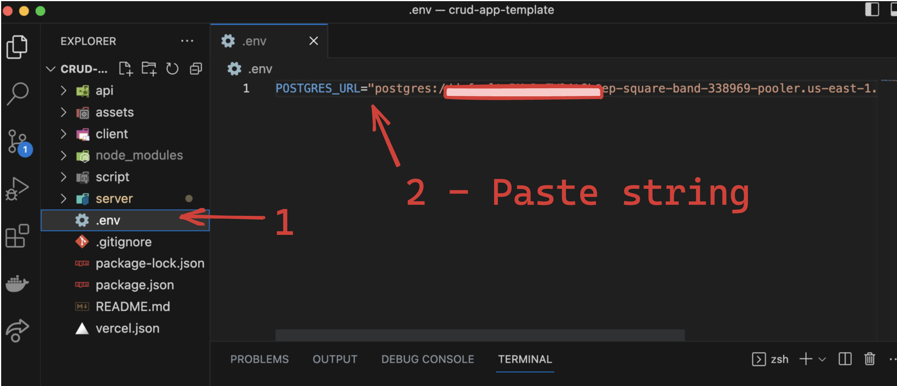

<a name="readme-top"></a>

<!-- PROJECT LOGO -->

# CRUD-APP-TEMPLATE

🚀 [See it live](https://crud-app-template.vercel.app/)

<!-- 📽️ [Watch video](https://www.youtube.com/watch?v=dmplVct15V8) -->

## 📦 Built With

- Create-react-app (React - Frontend)
- Node.js / Express.js (Backend)
- Sequelize (Postgres Database)
- Vercel (Deployment)

## 📚 Docs

### File Structure Overview



### Note - Install your frontend dependencies here (axios, react, redux, etc)

## 🏁 Getting Started

### 1. Clone the GitHub repo and cd into repo

```
git clone https://github.com/KYu-2468/crud-app-template.git
cd crud-app-template
```

### 2. Update application name and folder name

package.json -> name -> change from "crud-app-template" to your-application-name

change the folder name from "crud-app-template" to your-application-name

### 3. Create your own github repo



### 4. Connect your local repo to github

Disconnect local repo to the remote template repo

```
git remote remove origin
```

Connect local repo to your new github repo and follow the instructions on YOUR github page



### 5. Create local database (for development and testing)

```
createdb your-application-name
```

### 6. Install dependencies

#### Option 1 (recommended)

Install both frontend and backend

```
npm run install:all
```

#### Option 2

Install only backend dependencies first

```
npm install
```

Install only frontend dependencies next

```
cd client
npm install
```

### 7. Deploy via Vercel (Free Signup Require)

[Vercel Website](https://vercel.com/)
[Vercel Postgres Website](https://vercel.com/docs/storage/vercel-postgres/quickstart)







### 8. Create an .env file to store database secrets and API keys

```
touch .env
```



### 9. Start local server

```
npm run start:dev
```

<p align="right">(<a href="#readme-top">back to top</a>)</p>

## ✨ Collaborators

Kevin Yu: [LinkedIn](https://www.linkedin.com/in/kevinyu2468/)

<p align="right">(<a href="#readme-top">back to top</a>)</p>

## License

This project is available under the MIT license. See the [LICENSE](https://github.com/kiyohken2000/ReactNative-Expo-Firebase-Boilerplate-v2/blob/master/LICENSE) file for more info.

<!-- https://chartmyjog-8a62d.web.app/ -->
